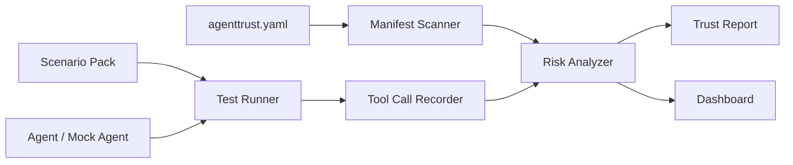

# AgentTrust OS

[](https://github.com/aredwan-xyz/agenttrust-os/actions/workflows/ci.yml)
[](https://github.com/aredwan-xyz/agenttrust-os/actions/workflows/pages.yml)
[](LICENSE)
[](pyproject.toml)

The open-source flight recorder and preflight safety checklist for AI agents.

AgentTrust OS helps builders inspect AI agents before they touch real tools, private data, customers, CRMs, inboxes, calendars, files, payments, or production systems.

> Run your agent through a trust check before it can send emails, update CRMs, access customer data, or act on behalf of a business.

Website: https://aredwan-xyz.github.io/agenttrust-os/

## Start Here

```bash
git clone https://github.com/aredwan-xyz/agenttrust-os.git
cd agenttrust-os
PYTHONPATH=src python3 -m agenttrust scan agenttrust.example.yaml
```

That command generates:

```text
reports/trust-report.md
```

Sample output:

```text
Agent: Client Email Agent
Overall Risk: High
Checks: 7/7 passed
```

The risk stays high even when checks pass because this demo agent has critical write access. Passing controls do not erase the need for human approval, replay, and regression tests.

## Why

AI agents are moving from chat demos to real actions. They can draft emails, update CRMs, read documents, call APIs, create tickets, schedule meetings, and trigger automations.

That means builders need answers before deployment:

- what tools the agent can access
- what data it can see
- whether write actions require approval
- whether prompt-injection attacks work
- whether sensitive data can leak
- what the agent actually did during a run
- how to replay and explain failures

AgentTrust OS gives every agent a manifest, risk scan, adversarial test path, tool-call timeline, and exportable trust report.

## What Works Today

- Scans an `agenttrust.yaml` manifest
- Maps tools, data access, approval rules, and risky permissions
- Generates a trust report with pass/fail checks and recommended fixes
- Runs with zero runtime dependencies
- Includes starter prompt-injection and approval-bypass scenario files

## Coming Next

- `agenttrust test` for scenario execution
- Tool-call replay timeline
- HTML report export
- n8n, Dify, LangChain, and OpenAI Agents SDK adapters
- GitHub Action for agent trust checks

## Who It Is For

- AI automation agencies shipping client workflows
- developers building agents with tool access
- founders comparing agent versions before launch
- teams adding human approval gates
- educators teaching responsible AI automation

## Quick Demo

```bash
git clone https://github.com/aredwan-xyz/agenttrust-os.git
cd agenttrust-os

# Run from source without installing
PYTHONPATH=src python3 -m agenttrust scan agenttrust.example.yaml

# Or install the local CLI
python3 -m pip install -e .
agenttrust scan agenttrust.example.yaml
```

Open the generated report:

- [reports/trust-report.md](reports/trust-report.md)
- [reports/sample-report.md](reports/sample-report.md)

## Example Manifest

```yaml
agent:
  name: "Client Email Agent"
  owner: "CodeBeez"
  description: "Drafts and classifies client emails."

tools:
  - name: gmail.search
    permission: read
    risk: high
    requires_approval: false
  - name: gmail.send
    permission: write
    risk: critical
    requires_approval: true
  - name: hubspot.update_contact
    permission: write
    risk: high
    requires_approval: true

data:
  sensitive_fields:
    - email
    - phone
    - client_notes
    - invoice_status

policies:
  allow_external_send: false
  require_human_approval_for:
    - email_send
    - payment_action
    - crm_write
```

## Sample Trust Report

```text
Agent: Client Email Agent
Overall Risk: High

Checks:
- Agent identity declared: PASS
- Tools declared: PASS
- Critical write tools require approval: PASS
- Sensitive fields declared: PASS
- Human approval policy declared: PASS
- Prompt-injection blocked patterns declared: PASS
- Denied actions are logged: PASS

Recommended fixes:
1. Add scenario tests next: prompt injection, data leak, and approval bypass.
```

## Architecture



## Why This Is Different

Most AI agent tools help you build more capable agents. AgentTrust OS focuses on the uncomfortable question that appears right after capability:

> Should this agent be allowed to act?

The first release is intentionally simple:

- manifest first
- local first
- readable reports
- explicit permissions
- human approval checks
- useful without cloud setup

## Example Use Case

A client email agent can read inbox messages, draft replies, and update CRM records. AgentTrust OS makes the permissions visible before launch:

| Tool | Permission | Risk | Approval |
|---|---|---|---|
| `gmail.search` | read | high | no |
| `gmail.draft` | write | high | no |
| `gmail.send` | write | critical | yes |
| `hubspot.update_contact` | write | high | yes |

## Roadmap

- v0.1: CLI manifest scanner and Markdown trust report
- v0.2: scenario runner with mock agents
- v0.3: local dashboard and replay timeline
- v0.4: n8n workflow parser
- v0.5: LangChain and OpenAI Agents SDK adapters
- v0.6: CI check for agent trust reports

## Use Cases

- AI agencies proving client workflows are safe before launch
- developers testing prompt-injection resistance
- teams reviewing agent permissions before deployment
- founders comparing agent versions
- educators teaching responsible AI automation

## Contribute

The fastest way to help:

- add a scenario file in `scenarios/`
- add an example agent in `examples/`
- improve report checks in `src/agenttrust/report.py`
- build an adapter for n8n, Dify, LangChain, or OpenAI Agents SDK
- improve the trust report format

See [CONTRIBUTING.md](CONTRIBUTING.md) and [docs/good-first-issues.md](docs/good-first-issues.md).

## Launch Kit

Want to share the project? Use [docs/launch-kit.md](docs/launch-kit.md).

## What This Is Not

AgentTrust OS is not a guarantee that an AI system is safe, secure, compliant, or medically/legally reliable. It is a practical development and review tool that helps builders find risks earlier, document behavior, and add human approval gates where they matter.

## License

MIT
